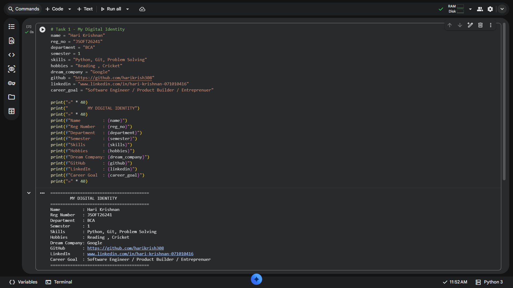
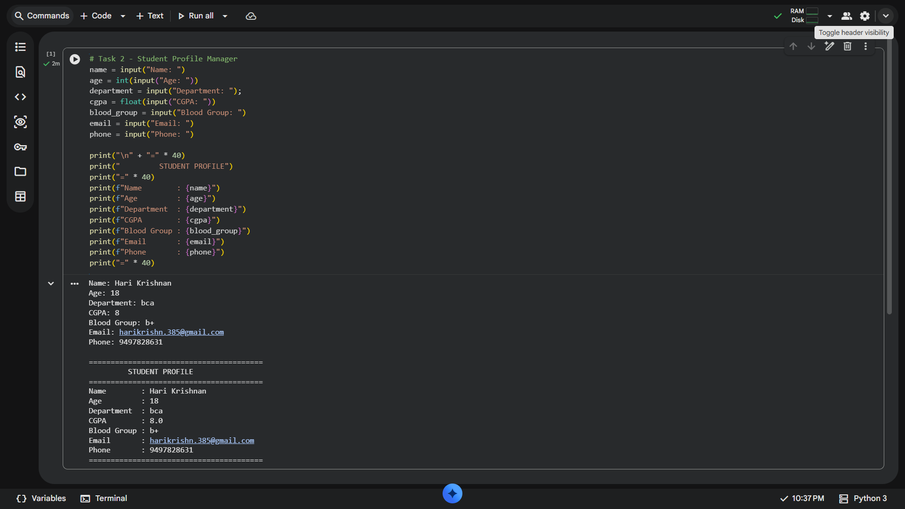
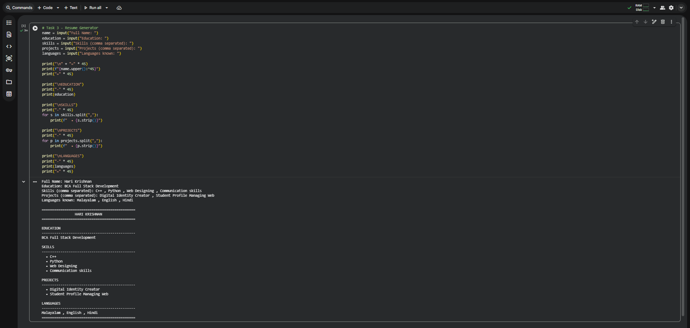

# Phase 1 - Task 1: My Digital Identity

## Description
This Python script prints a formatted personal identity card displaying key details such as name, registration number, department, skills, social links, and career goals using variables and formatted strings (`f-strings`).

## Code Concept
- **Variables:** Used to store personal information as strings and numbers.
- **f-strings (`f"..."`):** Used to insert variable values directly into the output format.
- **String Multiplication (`"=" * 40`):** Used to dynamically render visually clean divider lines.
- ## Output Screenshot

  
  -------

# Phase 1 - Task 2: Student Profile Manager

## 📌 Description
The **Student Profile Manager** is an interactive Python application designed to collect student details through live user inputs and format them into a structured digital profile card. It demonstrates dynamic input handling and standard formatting techniques in Python.

---

## 🛠️ Concepts & Features Covered
- **Dynamic User Inputs (`input()`):** Prompts the user to enter personal and academic information interactively during execution.
- **Data Type Casting (`int()`, `float()`):** Converts standard string inputs into numeric types for properties like age and CGPA.
- **Formatted Strings (`f-strings`):** Uses Python f-strings to align and render user details within a clean border layout.
- **String Multiplication:** Utilizes repetitive character operations (e.g., `"=" * 40`) to create uniform section dividers.

---

## 📋 Required Inputs
When executed, the program prompts for the following 7 parameters:
1. **Name** *(String)*
2. **Age** *(Integer)*
3. **Department** *(String)*
4. **CGPA** *(Float)*
5. **Blood Group** *(String)*
6. **Email** *(String)*
7. **Phone Number** *(String)*

---

## 📷 Output Preview

---------

---

# Phase 1 - Task 3: Resume Generator

## 📌 Description
The **Resume Generator** is an interactive command-line tool that gathers key professional details (Education, Skills, Projects, Languages) and prints a structured, easy-to-read text resume.

## 🛠️ Concepts Covered
- **String Manipulation (`.split()`, `.strip()`, `.upper()`):** Converts comma-separated user inputs into individual items while removing extra whitespace.
- **For Loops:** Iterates through lists of skills and projects to render clean bullet points.
- **Text Formatting (`:^45`):** Centers the candidate's name across a fixed character width for header alignment.

## 📷 Output Preview

